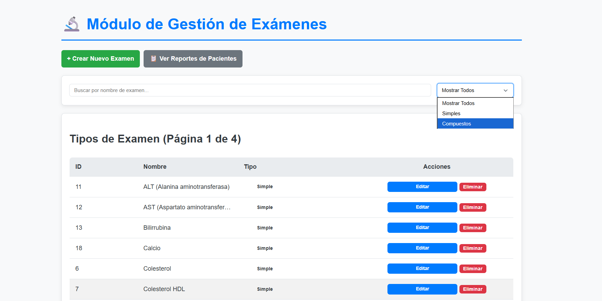
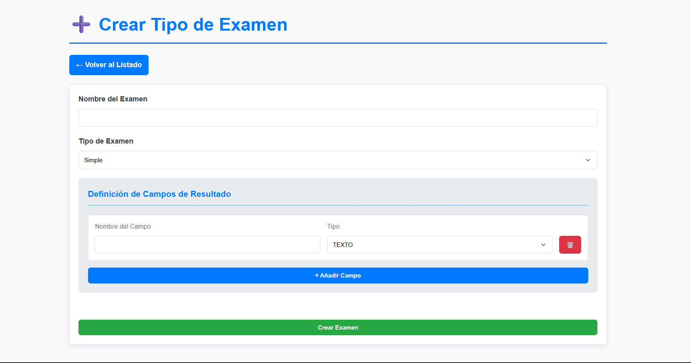
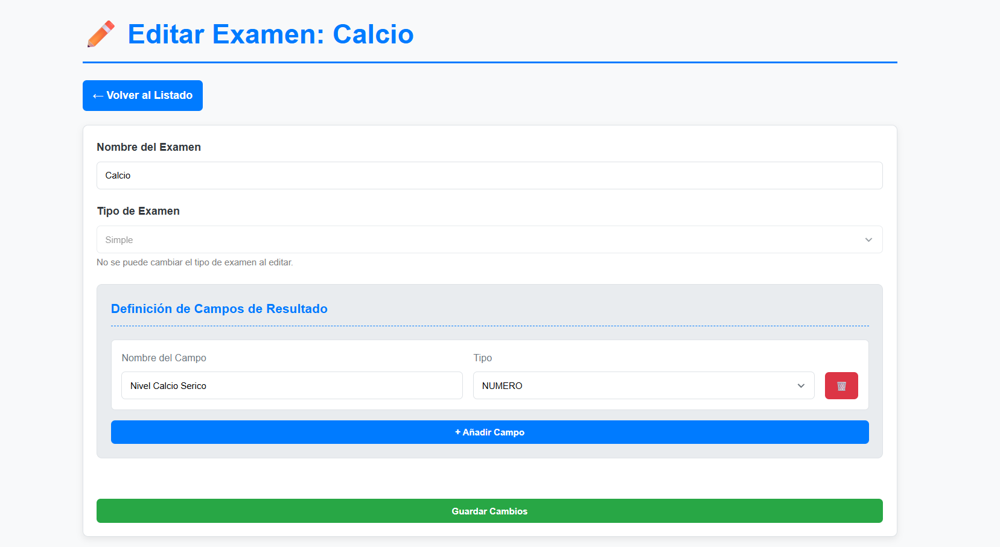
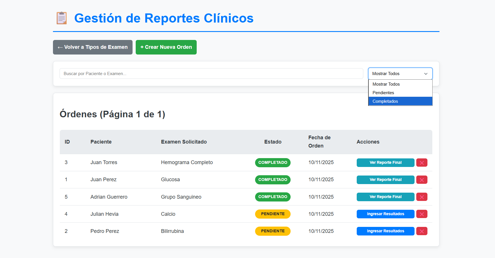
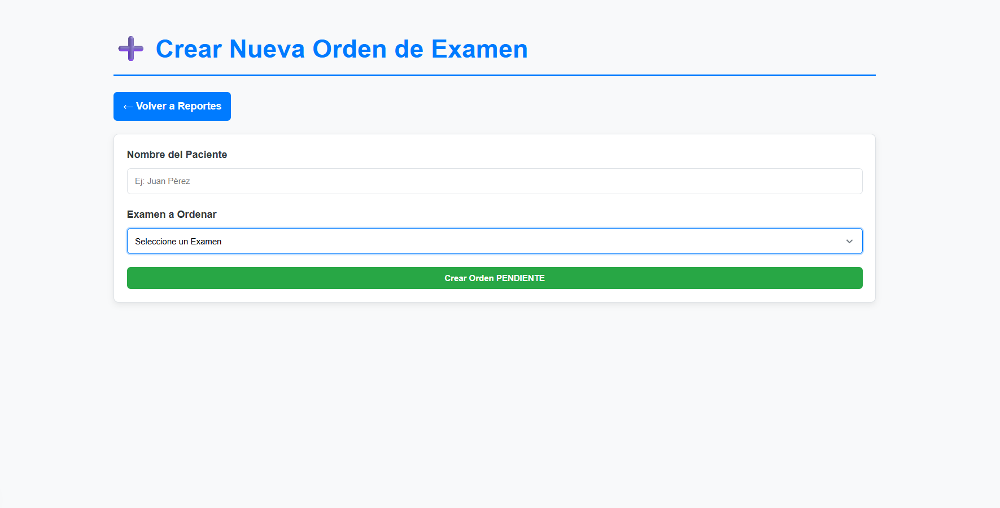
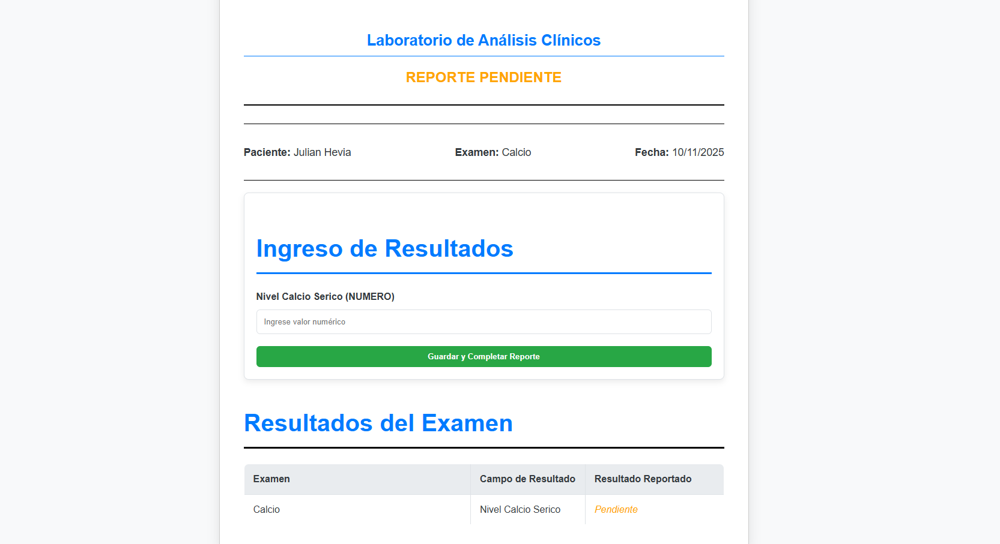
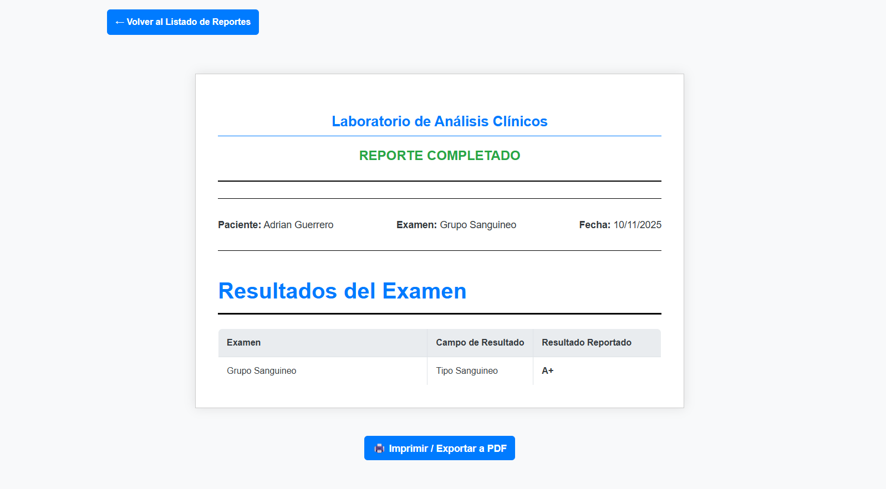
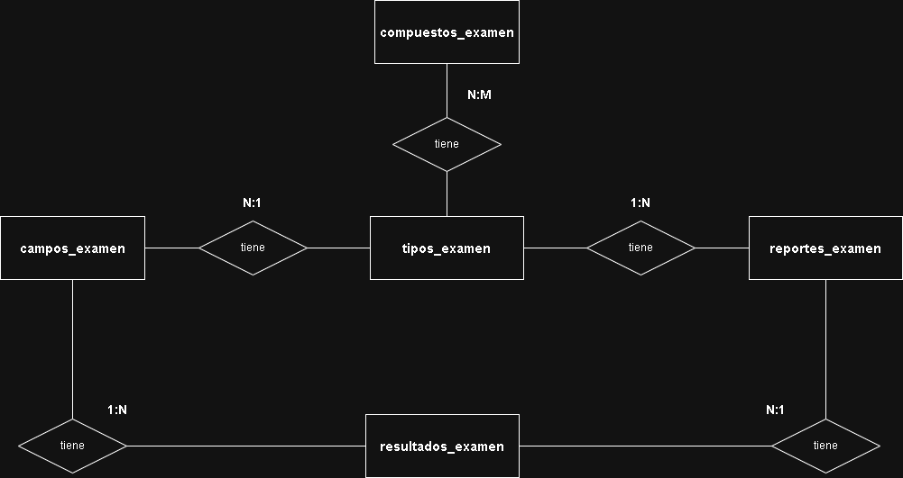
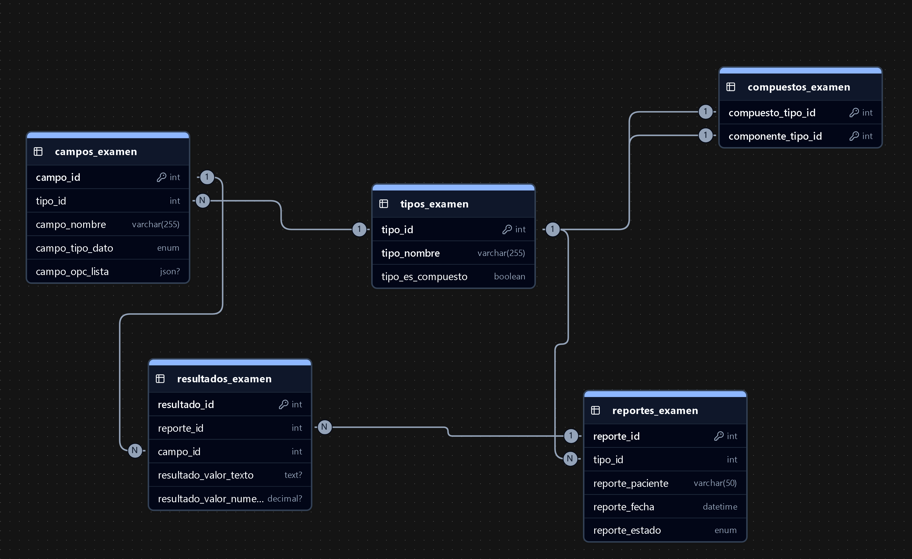

# 🔬 Sistema de Gestión de Exámenes de Laboratorio

## 🚀 Resumen del Proyecto

Este proyecto es un **Sistema de Gestión de Exámenes** diseñado para laboratorios. Permite a los usuarios definir y catalogar exámenes (tanto simples como complejos), crear órdenes de análisis para pacientes específicos, ingresar los resultados de cada prueba y generar reportes finales en formato PDF. El enfoque principal está en la **eficiencia operativa** y la **claridad en la documentación de resultados**.

---

## 🌐 Despliegue y Acceso

El proyecto está desplegado en vercel y la base de datos en aiven.io Accesible en la siguiente URL:

[https://prueba-lab-exams.vercel.app/]

---

## 💻 Stack Tecnológico

| Componente | Tecnología | Rol Principal |
| :--- | :--- | :--- |
| **Frontend/Backend** | **Next.js** | Interfaz de usuario, *Routing* (rutas), Implementación de APIs y Server Actions. |
| **Base de Datos** | **MySQL** | Almacenamiento persistente de la estructura de exámenes y datos transaccionales. |
| **Estilizado** | **Tailwind CSS** | Diseño *responsive* y personalización de estilos. |

---

## 🛠️ Módulos y Funcionalidades Clave

### A. Gestión de Catálogo de Exámenes

Esta sección se centra en la definición y mantenimiento de las pruebas de laboratorio.

* **Listado de Exámenes:** Permite listar, filtrar (por tipo de examen) y buscar exámenes por nombre. La visualización es ordenada alfabéticamente.
  
  *Figura 1: Vista general del listado de exámenes con opciones de filtrado y búsqueda.*

* **Creación de Exámenes:** Permite definir el nombre del examen, especificar si es **Simple** o **Compuesto**, y asociar los campos de resultado necesarios, definiendo su tipo de dato (texto, número, o lista).
  
  *Figura 2: Interfaz para la creación de nuevos exámenes, simple o compuesto.*

* **Edición de Exámenes:** Facilita la modificación del nombre y la estructura de campos de un examen existente. El **tipo de examen (Simple/Compuesto) no es editable** para mantener la integridad de los reportes históricos.
  
  *Figura 3: Pantalla de edición de un examen, mostrando campos modificables.*

### B. Gestión de Órdenes y Resultados (Reportes)

Este módulo maneja el flujo de trabajo desde que se solicita un examen hasta la entrega del resultado.

* **Listado de Reportes:** Muestra todas las órdenes de examen creadas. Permite filtrar por estado (**Pendiente** o **Completado**) y buscar por nombre del paciente o de la orden.
  
  *Figura 4: Tabla de reportes con filtros de estado y búsqueda.*

* **Creación de Reporte:** Genera una nueva orden de examen para un paciente, asignando el tipo de prueba a realizar.
  
  *Figura 5: Formulario para crear una nueva orden de examen para un paciente.*

* **Ingreso de Resultados:** Interfaz dedicada para introducir los valores finales de cada campo de la orden, según el tipo de dato predefinido.
  
  *Figura 6: Pantalla de ingreso de resultados para los campos de un examen.*

* **Visualización y Exportación:** Permite visualizar el resultado final del examen y ofrece la funcionalidad de **imprimir o exportar el reporte en formato PDF** (Reportar el ítem creado).
  
  *Figura 7: Vista del reporte de resultados finalizado, con opción de impresión PDF.*

---

## 🏛️ Diseño de la Base de Datos

El diseño de la base de datos MySQL está optimizado para manejar la lógica de la composición de exámenes (Simples vs. Compuestos) de manera eficiente.

### 1. Diagrama Entidad-Relación (MER)

Muestra la arquitectura conceptual de las tablas principales y sus relaciones.


*Figura 8: Diagrama de Entidad-Relación (MER) de la base de datos `lab_examenes_db`.*

### 2. Diagrama Relacional

Muestra la arquitectura física de las tablas, incluyendo las **llaves primarias (PK)** y **llaves foráneas (FK)** que definen las relaciones.


*Figura 9: Diagrama Relacional que ilustra la arquitectura física de las tablas.*

### Documentación

La descripción detallada del diccionario de datos y las consultas clave se encuentra en el archivo: [`documentacion-base-de-datos.pdf`](./documentacion-base-de-datos.pdf)

---

## 🤖 Asistencia de Inteligencia Artificial

Este proyecto se benefició significativamente de la asistencia de **Gemini 2.5**. La IA fue instrumental en las siguientes áreas técnicas:

* **Optimización de Estilos y *Responsive Design*:** Asistencia en la mejora de la estética y la implementación de un diseño **adaptable** y profesional utilizando Tailwind CSS.
* **Lógica de Búsqueda y Filtrado:** Desarrollo e implementación eficiente de las funciones de búsqueda y filtrado en los listados del sistema.
* **Optimización y *Debugging*:** Soporte continuo para la corrección de errores, optimización de código base y consultas puntuales sobre patrones de programación.
* **Documentación Profesional:** Generación de la estructura profesional del archivo README y la documentación detallada de la base de datos.

---

## ⚙️ Configuración y Ejecución Local

Sigue estos pasos para levantar el proyecto en tu entorno local.

1.  **Clonar el Repositorio:**
    ```bash
    git clone [https://github.com/elmerrondon/prueba-lab-exams.git](https://github.com/elmerrondon/prueba-lab-exams.git)
    cd prueba-lab-exams
    ```
2.  **Instalar Dependencias:**
    ```bash
    npm install
    ```
3.  **Configuración de la Base de Datos (MySQL):**
    * Crea una base de datos MySQL vacía.
    * Ejecuta el script de creación de tablas disponible en: `database/db.sql`.
    * Crea un archivo `.env` en la raíz del proyecto y configura las credenciales de conexión:
        ```bash
        # Ejemplo de credenciales en .env
        DB_HOST=localhost
        DB_USER=root
        DB_PASSWORD=
        DB_NAME=nombre_de_tu_base
        DB_PORT=
        ```
4.  **Iniciar el Servidor de Desarrollo:**
    ```bash
    npm run dev
    ```

El sistema estará disponible en `http://localhost:3000`.